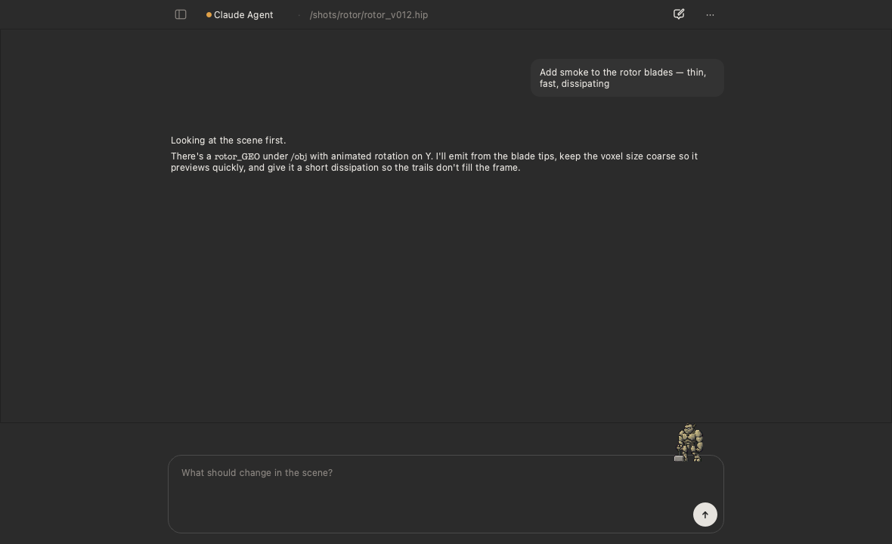
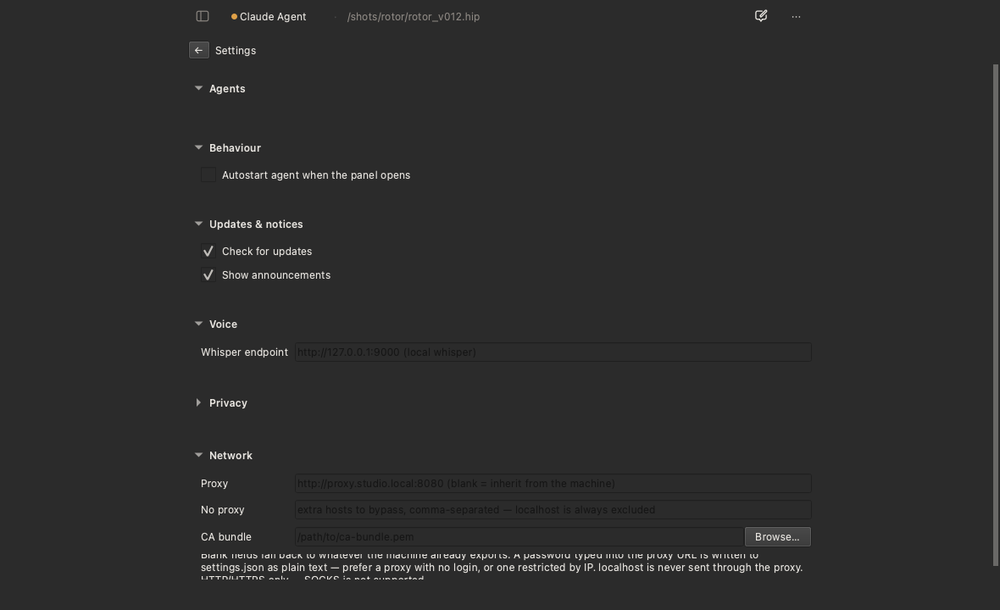

# 🐉 houdini-agent-panel

**An AI agent inside Houdini. One command to install, no terminal to keep open.**



Ask for what you want in the scene. The agent works on the `.hip` you have
open — no ports to pick, no config to write.

## 🔧 Built on fxhoudinimcp

The scene tools are not ours. They come from
**[healkeiser/fxhoudinimcp](https://github.com/healkeiser/fxhoudinimcp)** —
189 MCP tools over Houdini's official `hwebserver`, and the reason an agent
can read geometry, build networks and cook nodes at all.

This project is the layer that makes them usable without a terminal: an ACP
client, an installer, and a panel. Credit and any thanks for the tools
themselves belong upstream. 🙏

---

## ⚡ Install

**macOS · Linux**

```sh
curl -fsSL --connect-timeout 15 https://raw.githubusercontent.com/MAY4VFX/houdini-agent-panel/main/scripts/install.sh | sh
```

**Windows** (PowerShell)

```powershell
irm https://raw.githubusercontent.com/MAY4VFX/houdini-agent-panel/main/scripts/install.ps1 | iex
```

**Already have `uv`?**

```sh
uvx --from houdini-agent-panel python -m houdini_agent_panel install
```

Restart Houdini → **Tab → Python Panels → Agent**. 🎉

The installer finds every Houdini on the machine and installs into each one's
own Python — 20.5 ships 3.11, 22 ships 3.13, and `pydantic`'s compiled core
means one shared tree for both is impossible.

Behind a proxy? Export it in the shell running the command above —
`export HTTPS_PROXY=http://proxy.studio.local:8080` before the `curl`/`irm`
line. This install step runs before the panel exists, so it can't yet read
the **Settings → Network** field described in "Behind a studio proxy" below;
once it's installed, the panel picks up the same variable on its own.

## 🤖 Agents

Claude Agent · Codex · Gemini CLI · Grok Build · Kimi CLI · OpenCode

Pick one in the panel; only that one gets installed. Node comes bundled if
your machine hasn't got it.

Two of them — Claude Agent and Codex — are ACP *adapters* published by the
protocol project; the other four are the CLIs themselves with ACP built in.

**The panel installs agents but never configures them.** Providers, API keys
and MCP servers stay in the agent's own files, exactly as in a terminal. An
agent you already use will work here with nothing further to do.

## 🔑 Signing in

1. Pick an agent — it installs and connects.
2. Type `/login` and follow it. 🌐
3. That's it. The panel stores no credentials and asks for none.

Some agents advertise their sign-in methods and get a proper sign-in screen
instead. OpenCode has no login at all: it reads a provider and a key from
`~/.config/opencode/opencode.json`.

## ⚙️ Settings



Install and update agents, pick what starts with the panel, and point it at
your studio's network — see below.

## 🌐 Behind a studio proxy

Common in VFX: the firewall drops direct egress and everything goes out
through `proxy.studio.local:8080`, often with TLS inspection.

Fill in **Settings → Network** and it covers all of it — the agent's own
traffic, the `npx` fetch that installs an agent, and the panel's own
downloads (registry, updates, portable Node). No Houdini restart: the panel
offers to restart the agent right there.

| Field | What it's for |
| --- | --- |
| **Proxy** | `http://proxy.studio.local:8080`. Blank = inherit whatever the machine exports. |
| **No proxy** | Extra hosts to bypass. `localhost` is *always* excluded — the Houdini bridge must never take a detour. |
| **CA bundle** | For inspecting proxies that present their own certificate. Verification is never disabled — there is no setting for that. |

**HTTP/HTTPS only — SOCKS is not supported.** For SOCKS or NTLM/Kerberos,
put a local bridge like [`px`](https://github.com/genotrance/px) or
`cntlm` in front and point the panel at that.

⚠️ A password typed into the proxy URL is stored in `settings.json` as plain
text. Prefer a proxy with no login, or one restricted by IP. Diagnostics
redact it; the file does not.

Already exporting `HTTPS_PROXY` in your shell profile? Then there is nothing
to do — the panel reads your login shell and hands the agent the same
environment you get in a terminal.

## 🔒 Privacy

Telemetry is **off** by default. Scenes, prompts and paths are never
collected — [`docs/privacy.md`](docs/privacy.md).

## 🛠 Development

```sh
uv venv --python 3.11 .venv
uv pip install --python .venv/bin/python -e ".[dev]"
.venv/bin/python -m pytest -q
```

Tests never touch the network and never write outside `tmp_path` — enforced
by fixtures, not by discipline.

The UI runs without Houdini, with real widgets and a fake session, and
restarts itself on every save:

```sh
.venv/bin/python -m houdini_agent_panel.dev_preview --watch
```

More commands:

```sh
python -m houdini_agent_panel install --dry-run   # show the plan, change nothing
python -m houdini_agent_panel doctor              # what was found, what's broken
python -m houdini_agent_panel uninstall --purge   # remove, data folder included
```

## 📚 Docs

[Design](docs/design.md) · [Architecture](docs/architecture.md) ·
[Verified facts about Houdini, ACP and fx](docs/facts/)

## License

MIT
